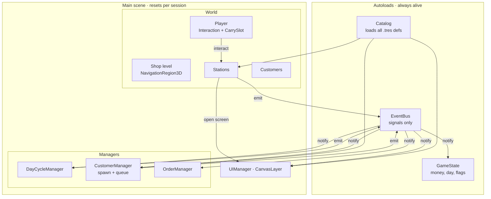
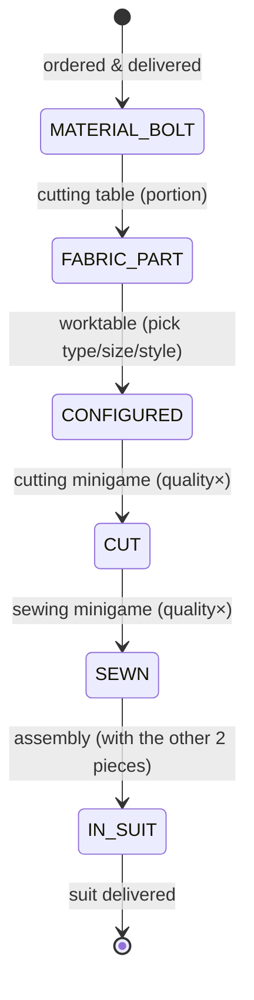
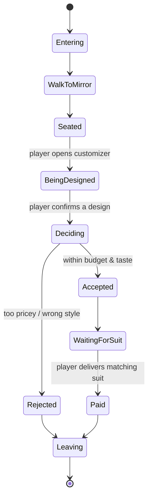
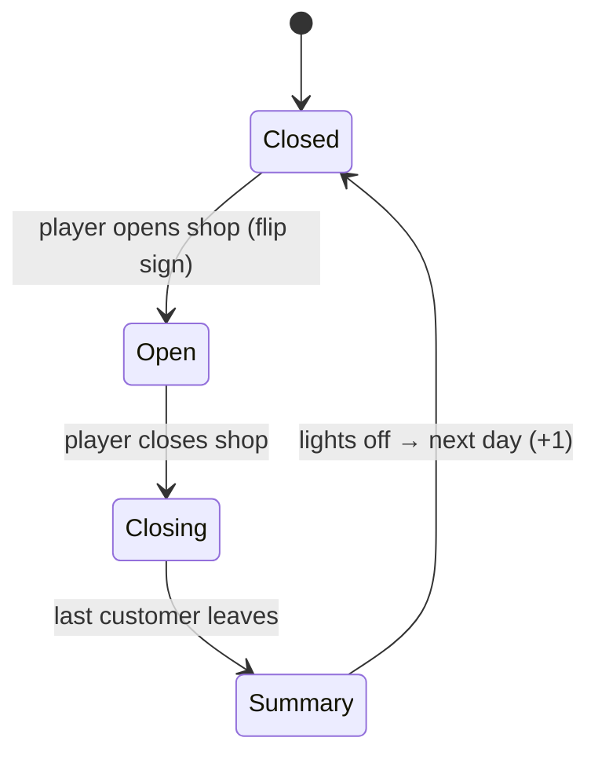

# TailorTown — Game Design & Architecture

> ⚠️ **Historical plan.** This is the *original* design/phase plan. Phases 0–7 are
> now built and the implementation has diverged in places (e.g. runtime items are
> Node3D scenes, not `RefCounted`; the day is a timed shift). For the **current,
> accurate** state read [`PROJECT_STATE.md`](PROJECT_STATE.md); for what's next,
> [`ROADMAP.md`](ROADMAP.md). Kept here for design intent and rationale.

> Living document. This is the *base* plan; we add detail per phase. Status
> markers: ✅ done · 🔜 next · ⬜ later.

## 1. The game in one paragraph

You run a tailoring shop from a top-down 3D view. You physically walk around,
**carry one item at a time**, and move raw material through a **crafting
pipeline** at fixed **stations** (phone → shelf → cutting → worktable → sewing).
Customers arrive with a **style preference and a budget**, sit at the mirror, and
you design a suit for them part-by-part in a customizer. If they accept, you get
an **order**; you craft the matching pieces (shirt + pants + jacket), assemble the
**suit**, and deliver it for money. The shop runs on a **day cycle** you open and
close; turning the lights off ends the day.

The whole game is really two verbs — **carry** and **use a station** — plus
**data** describing materials, garments, customers and orders. Nail those and
everything else is content.

## 2. Design pillars (what the architecture must protect)

- **Tactile item flow.** One item in your hands at a time; stations transform it.
  The player's inventory is literally the world.
- **Data-driven content.** Materials, garment patterns, styles, customer types
  are Godot `Resource` files (`.tres`) a designer edits — no code to add content.
- **Decoupled systems.** Stations, customers, economy and UI never call each other
  directly; they talk through a signal **EventBus**. You can build/test each alone.
- **Everything is a small state machine.** Garment lifecycle, customer AI, day
  cycle, minigames — explicit states, no boolean soup.
- **Separation of data and view.** A garment's *state* is a plain data object; the
  thing you carry is a *node* that visualises that data. Same for customers/orders.

## 3. Core loop

```mermaid
flowchart LR
    Phone[📞 Order material] --> Deliver[Material bolt appears]
    Deliver --> Shelf[🧵 Store on shelf]
    Shelf --> Portion[✂️ Cut a part off bolt]
    Portion --> Worktable[🪡 Worktable: pick type/size/style]
    Worktable --> CutMini[Cutting minigame]
    CutMini --> Sew[🧶 Sewing machine: sewing minigame]
    Sew --> Piece[Finished piece]
    Piece --> Assemble[Assemble shirt+pants+jacket]
    Assemble --> Suit[🥼 Complete suit]
    Customer[🧍 Customer at mirror] --> Design[Suit customizer]
    Design --> Order[Order created]
    Order -.target spec.-> Worktable
    Suit --> Deliver2[Deliver to customer 💰]
```



## 4. Data model (the heart of it)

All *definitions* are Resources (shared, immutable, authored as `.tres`). All
*runtime instances* are plain `RefCounted`/`Resource` data objects (mutable, per-item).

### Enums (`res://data/scripts/enums.gd`, an autoload or a `class_name Enums`)
```gdscript
enum GarmentType { SHIRT, PANTS, JACKET }
enum Size { S, M, L, XL }
enum ItemKind { MATERIAL_BOLT, FABRIC_PART, GARMENT_PIECE, SUIT }
# Where a garment piece is in its life:
enum Stage { FABRIC_PART, CONFIGURED, CUT, SEWN }
```

### Definitions (Resources — content authored in the editor)
```gdscript
# res://data/scripts/material_type.gd
class_name MaterialType extends Resource
@export var id: StringName
@export var display_name: String
@export var albedo: Texture2D            # or base Color + pattern
@export var patterns: Array[Texture2D]
@export var cost_per_bolt: int
@export var parts_per_bolt: int          # how many fabric parts one bolt yields

# res://data/scripts/garment_pattern.gd
class_name GarmentPattern extends Resource
@export var id: StringName
@export var type: Enums.GarmentType
@export var base_value: int
@export var cut_difficulty: float        # feeds the cutting minigame
@export var sew_difficulty: float        # feeds the sewing minigame
@export var styles: Array[StringName]    # e.g. shorts vs long pants
```

### Runtime instance (one flexible carried item)
```gdscript
# res://entities/items/carried_item.gd
class_name CarriedItem extends RefCounted
var kind: Enums.ItemKind
var material: MaterialType
var color: Color
var pattern_index: int = -1
# garment fields (only meaningful once kind == GARMENT_PIECE):
var garment_type: Enums.GarmentType
var size: Enums.Size
var style: StringName
var stage: Enums.Stage
var quality: float = 1.0                 # accumulated from minigames (0..1)
```

### Aggregates
```gdscript
# A suit is up to three SEWN pieces.
class_name Suit extends RefCounted
var pieces := {}                         # { GarmentType : CarriedItem }
func value() -> int: ...                 # from base_value * quality * material
func matches(order: CustomerOrder) -> float: ...   # 0..1 how well it fits the spec

# What a customer agreed to.
class_name CustomerOrder extends RefCounted
var spec := {}                           # per-part desired material/color/pattern/style
var budget: int
var patience: float
```

> **Why RefCounted for instances, Resource for definitions?** Definitions are
> shared and saved to disk; instances are throwaway per-item state you don't want
> accidentally aliased across items. If we later need to *save* in-progress items
> (mid-craft save game), promote `CarriedItem` to `Resource`.

## 5. System architecture



**Autoloads (global, singletons):**
- **`GameState`** *(exists)* — money, current day, unlocks, persistent flags.
- **`EventBus`** — a `Node` that only declares `signal`s. Everyone emits/listens
  here instead of referencing each other. The single most important decoupling tool.
- **`Catalog`** — loads every `MaterialType`/`GarmentPattern` `.tres` at boot into
  dictionaries keyed by `id`, so any system can look defs up by id.

**Managers (nodes in Main, not autoloads — they reset with the scene):**
- **`DayCycleManager`**, **`CustomerManager`**, **`OrderManager`**.

> Rule of thumb: *global & save-worthy* → autoload; *gameplay that should reset
> when you reload the level* → node in Main.

### EventBus signals (starter set)
```gdscript
extends Node
signal money_changed(amount: int, balance: int)
signal material_ordered(material: MaterialType, qty: int)
signal material_delivered(material: MaterialType)
signal item_picked_up(item: CarriedItem)
signal item_placed(item: CarriedItem, station: Node)
signal garment_stage_advanced(item: CarriedItem)
signal minigame_completed(kind: StringName, quality: float)
signal customer_arrived(customer: Node)
signal design_confirmed(order: CustomerOrder)
signal order_created(order: CustomerOrder)
signal order_fulfilled(order: CustomerOrder, suit: Suit, payout: int)
signal day_started(day: int)
signal shop_opened()
signal shop_closed()
signal day_ended(summary: Dictionary)
```

## 6. Interaction & carry model (Phase 1 core)

Two reusable pieces, added by **composition**:

- **`Interactable`** — a script on an `Area3D` (or a child of a station) exposing:
  ```gdscript
  func can_interact(actor) -> bool
  func get_prompt() -> String        # "Order materials", "Place on shelf"
  func interact(actor) -> void
  ```
- **Player `InteractionController`** — each frame finds the nearest `Interactable`
  in range (Area3D overlap or a short `ShapeCast3D`), shows its prompt on the HUD,
  and on the `interact` input action calls `interact(self)`.
- **Player `CarrySlot`** — holds **one** `CarriedItem` plus its visual node at a
  hold point (a `Marker3D` in front of the player). `pick_up(item, view)`,
  `drop()`, `is_empty()`. Stations query/ް fill this slot.

**Carryable visual** — one `carryable.tscn` (a `Node3D` with a swappable
`MeshInstance3D` + label) that renders *any* `CarriedItem` by kind/stage. The data
object is the truth; the node is a puppet.

## 7. Stations (state machines that transform items)

Common base `StationBase` (extends/holds an `Interactable`):
```gdscript
func accepts(item: CarriedItem) -> bool     # is this the right input?
func on_interact(actor) -> void             # take from / give to the player's CarrySlot
```
Each station is its **own scene** under `res://stations/`:

| Station | Input | Action | Output |
|---|---|---|---|
| **Phone** | — | open Phone Order UI, spend money | schedules `material_delivered` |
| **Delivery spot** | — | receives ordered bolts | `MATERIAL_BOLT` to pick up |
| **Shelf** | bolt | store/retrieve (multi-slot storage) | bolt |
| **Cutting table** | bolt | portion a part off (consumes bolt yield) | `FABRIC_PART` |
| **Worktable** | fabric part | Config UI (type/size/style) → **cut minigame** | `CONFIGURED`→`CUT` piece |
| **Sewing machine** | cut piece | **sew minigame** | `SEWN` piece |
| **Assembly/mannequin** | 3 sewn pieces | combine | `SUIT` |
| **Mirror + stool** | (customer) | Suit Customizer UI | `CustomerOrder` |

Stations validate stage transitions (`accepts`) so you can't sew a raw bolt.

## 8. Garment lifecycle (explicit state machine)



`quality` is multiplied at each minigame, so sloppy cutting *and* sloppy sewing
both drag the final suit value down — a natural skill curve.

## 9. Customers & orders

**`Customer`** = `CharacterBody3D` + `NavigationAgent3D` (customers pathfind even
though the *player* uses WASD, so the shop needs a baked `NavigationRegion3D`).
AI is a small state machine:



- **`CustomerManager`** spawns customers while the shop is OPEN (rate ramps with
  progression), manages a queue for the mirror, despawns on leave.
- On **`design_confirmed`**, an `Order` is created and tracked by **`OrderManager`**.
  Delivery = bring a `Suit` whose `matches(order)` clears a threshold within budget.

## 10. Day cycle

**`DayCycleManager`** state machine, driving lighting + spawning:



Emits `day_started` / `shop_opened` / `shop_closed` / `day_ended`. Ties into the
`WorldEnvironment`/lights (dim → off) and gates `CustomerManager` spawning.

## 11. UI architecture

**`UIManager`** (a `CanvasLayer`) owns screen scenes and a stack:
- `HUD` (money, day, interaction prompt, held item) — always on.
- `PhoneOrderUI`, `WorktableConfigUI`, `SuitCustomizerUI`, `DaySummaryUI` — opened
  on demand; opening a modal screen sets a "menu" game state (pauses movement).
- Screens return results via **signals**, not return values, e.g.
  `SuitCustomizerUI.design_confirmed(order)` → EventBus. Minigames live in
  `res://minigames/` and emit `finished(result)`.

## 12. Folder / scene structure (target)

```
res://
├── globals/        game_state.gd, event_bus.gd, catalog.gd   (autoloads)
├── data/
│   ├── scripts/    enums.gd, material_type.gd, garment_pattern.gd
│   ├── materials/  *.tres   (content)
│   └── garments/   *.tres   (content)
├── entities/
│   ├── player/     player.tscn + controller, camera rig
│   ├── items/      carryable.tscn, carried_item.gd
│   └── customer/   customer.tscn, customer_brain.gd, customer_order.gd
├── stations/       station_base.gd, phone/, shelf/, cutting_table/,
│                   worktable/, sewing_machine/, assembly/, mirror/
├── systems/        interaction/, day_cycle/, customer_manager/, order_manager/
├── ui/             ui_manager.tscn, hud/, phone_order/, worktable_config/,
│                   suit_customizer/, day_summary/
├── minigames/      cutting/, sewing/
└── scenes/
    ├── world/      shop level(s) + NavigationRegion3D
    └── main.tscn
```
*(We'll migrate the current `scenes/player` + `scenes/camera` into `entities/`
when we start Phase 1 — small, mechanical move.)*

## 13. Godot practices we'll hold to

- Typed GDScript, `@export` for anything tunable, read shared constants from
  Project Settings. (Validated by `./tools/dev.ps1 validate` + `gdlint`.)
- Content = `.tres` Resources; **no hardcoded item lists**.
- Systems communicate via **EventBus signals**; no cross-manager hard references.
- One responsibility per scene; compose with `Interactable`/`CarrySlot` components.
- Every multi-state thing is an explicit state machine (enum + `match`, or a tiny
  state-node pattern once they get complex).

## 14. Phased dev plan

Each phase ends in something **runnable and testable** (via the MCP live loop +
`validate`/`shot`). Detail is filled in when we *start* the phase.

- **Phase 0 — Foundation** ✅  Player movement, camera, greybox, tooling, MCP.
- **Phase 1 — Interaction & carry** 🔜  `Interactable`, `InteractionController`,
  `CarrySlot`, `carryable.tscn`, `EventBus` + `Catalog` autoloads, `CarriedItem`.
  Greybox shop room with placeholder station boxes.
  *Deliverable:* pick up a box at station A, carry it, place it at station B.
- **Phase 2 — Material flow** ⬜  `MaterialType` content, Phone Order UI + economy,
  immediate delivery spot, Shelf storage.
  *Deliverable:* order material on the phone → it appears → shelve it.
- **Phase 3 — Crafting pipeline (instant, no minigames)** ⬜  Cutting table,
  Worktable config UI, sewing machine (placeholder-instant), garment state machine,
  assembly into a Suit.
  *Deliverable:* material → configured → sewn piece → assemble a full suit.
- **Phase 4 — Minigames** ⬜  Cutting (trace/timing) and sewing (rhythm) minigames
  feeding `quality`.
  *Deliverable:* real minigames gate the pipeline; quality changes suit value.
- **Phase 5 — Customers & orders** ⬜  `NavigationRegion3D`, customer AI + spawner,
  Mirror + Suit Customizer, order creation, delivery & payment.
  *Deliverable:* customer designs a suit, accepts, you craft & deliver, get paid.
- **Phase 6 — Day cycle & economy** ⬜  `DayCycleManager`, open/close, lights-off →
  next day, day summary, restock; optional save/load.
  *Deliverable:* a full, repeatable day.
- **Phase 7+ — Content & polish** ⬜  more materials/patterns/styles, art pass over
  greybox, audio, tutorial, upgrades/progression.

## 15. Open questions (decide as we reach them)

- Storage: does the shelf hold *specific* bolts by slot, or an abstract stock count?
- Camera at stations: keep the top-down follow, or reframe/zoom when using a
  station? (Affects minigame readability.)
- Order strictness: must the delivered suit match the design *exactly*, or is
  "close enough within budget" enough (quality-graded payout)?
- Do multiple in-progress pieces need to persist across a save mid-day?
- Failure states: can you ruin a piece (waste material) on a botched minigame?
```
